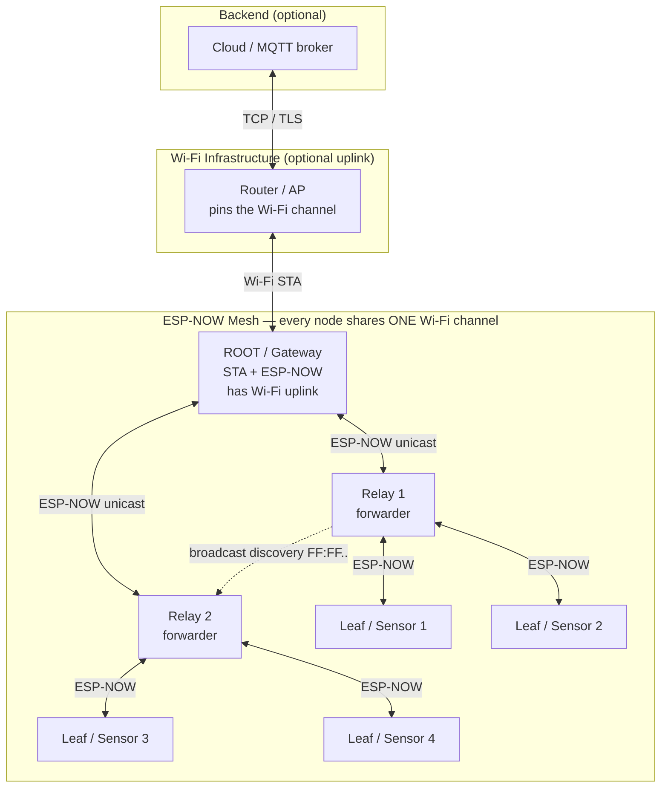
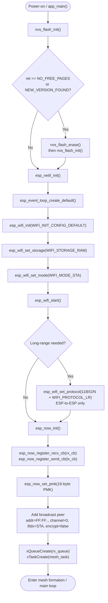
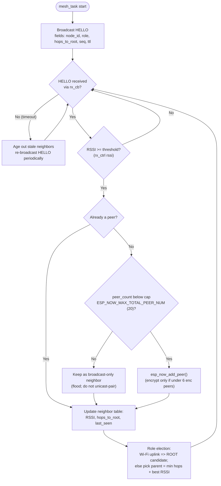
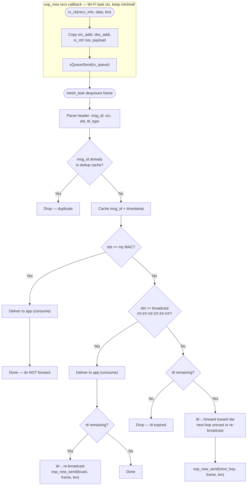
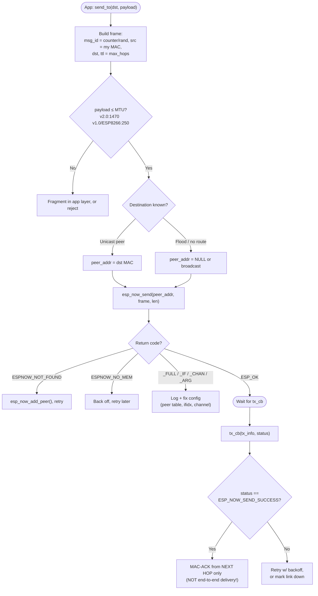
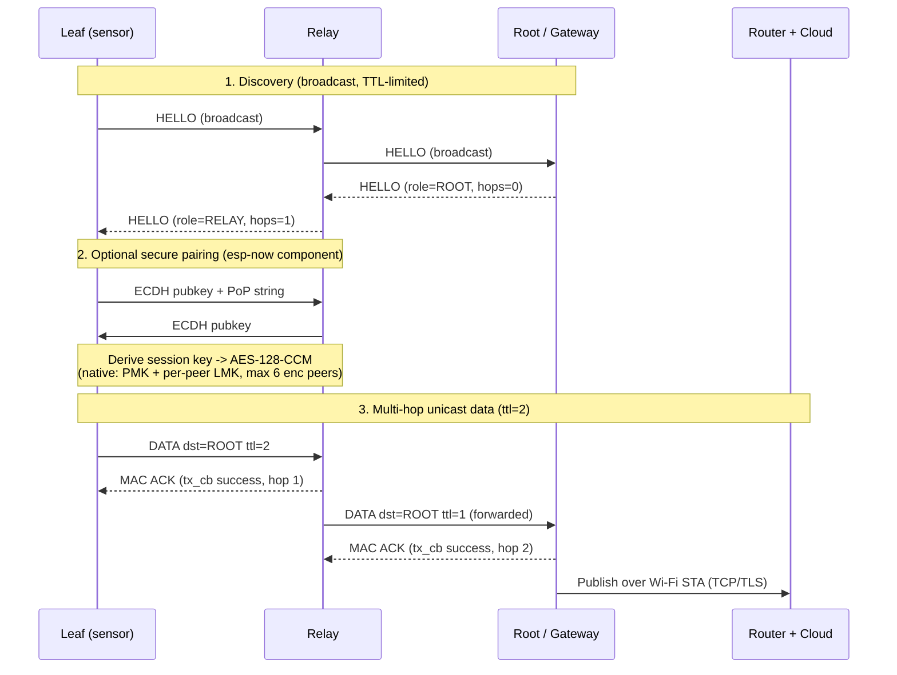

# ESP-NOW Mesh Network Architecture (ESP-IDF v6.0.0)

**Scope**

| Item | Value |
|---|---|
| Target MCUs | ESP32, ESP32-S3, ESP32-C3, ESP32-C5, ESP32-C6 (ESP-IDF v6.0.0) + ESP8266 (see caveat) |
| Connectivity | ESP-NOW (connectionless Wi-Fi action frames, data-link layer) |
| Flash worker (esp32) | 4 MB |
| Flash gateway (esp32s3) | 16 MB |
| Bit rate | 1 Mbps default |
| Payload | 1470 B (ESP-NOW v2.0) / 250 B (v1.0 & ESP8266) |

> **First, a naming distinction.** "ESP-NOW mesh" is a **flat, connectionless, multi-hop** network: you (or the `espressif/esp-now` component) implement discovery, dedup, and packet *forwarding* on top of the raw `esp_now_*` API. It is **not** ESP-WIFI-MESH, which is a **tree topology** (parent/child, single root) built on the Wi-Fi infrastructure stack. This document covers the ESP-NOW forwarding mesh.

---

## 1. Network Topology



Each device can hold **both** roles at once (initiator = sends/originates, responder = receives/acts). Relays simply originate their own traffic *and* forward traffic addressed to others.

---

## 2. Per-Node Firmware Initialization Workflow

Wi-Fi must be started **before** ESP-NOW. This sequence mirrors the ESP-IDF `wifi/espnow` example.



> `channel = 0` on a peer means "use whatever channel the STA/AP is currently on." If ROOT also joins a router, ESP-NOW is **locked to the router's channel** — design all nodes around that.

---

## 3. Mesh Formation, Neighbor Table & Role Election



---

## 4. Receive Path + Multi-Hop Forwarding (the heart of the mesh)

The receive callback runs in **Wi-Fi task context** — copy the frame and hand it to a queue; never run routing logic or call `esp_now_send()` inside the callback.



The current recv callback signature exposes the **destination address** (`recv_info->des_addr`) and **RSSI** (`recv_info->rx_ctrl`), which is exactly what makes the consume-vs-forward and RSSI-filter decisions above possible.

---

## 5. Transmit Path + Send Callback



> **`esp_now_send(peer_addr, ...)`**: if `peer_addr` is non-NULL → unicast to that peer; if NULL → send to **all** peers in the list. The TX callback's success status is a **per-hop MAC ACK** for unicast (broadcast is never ACKed) — it is not proof the packet reached the final destination across hops. End-to-end reliability is your app layer's job (ACK/seq).

---

## 6. End-to-End Sequence: Multi-Hop Unicast (+ optional secure pairing)



---

## 7. ESP-IDF v6.0.0 API & Constant Mapping

**Core functions** (`esp_now.h`)

| Function | Purpose |
|---|---|
| `esp_now_init()` / `esp_now_deinit()` | Start / stop ESP-NOW (after `esp_wifi_start()`) |
| `esp_now_register_recv_cb()` / `esp_now_register_send_cb()` | Install RX / TX callbacks |
| `esp_now_set_pmk()` | Set 16-byte Primary Master Key (encrypts LMKs) |
| `esp_now_add_peer()` / `esp_now_del_peer()` / `esp_now_mod_peer()` | Manage peer list |
| `esp_now_send(peer_addr, data, len)` | Send; `peer_addr=NULL` → all peers |
| `esp_now_get_version()` | Returns v1.0 or v2.0 |

**Callback signatures**

```c
void rx_cb(const esp_now_recv_info_t *info, const uint8_t *data, int len);
//   info->src_addr, info->des_addr, info->rx_ctrl (RSSI, channel, ...)
void tx_cb(const esp_now_send_info_t *tx_info, esp_now_send_status_t status);
```

**Key constants**

| Symbol | Value | Meaning |
|---|---|---|
| `ESP_NOW_ETH_ALEN` | 6 | Peer MAC length |
| `ESP_NOW_KEY_LEN` | 16 | PMK / LMK length |
| `ESP_NOW_MAX_TOTAL_PEER_NUM` | 20 | Max total peers |
| `ESP_NOW_MAX_ENCRYPT_PEER_NUM` | 6 | Max **encrypted** peers |
| `ESP_NOW_MAX_DATA_LEN` | 250 | v1.0 payload |
| `ESP_NOW_MAX_DATA_LEN_V2` | 1470 | v2.0 payload |

**Error codes** (`ESP_ERR_ESPNOW_*`): `NOT_INIT`, `ARG`, `NO_MEM`, `FULL`, `NOT_FOUND`, `INTERNAL`, `EXIST`, `IF`, `CHAN`.

**`esp_now_peer_info_t`**: `peer_addr[6]`, `lmk[16]`, `channel` (0 = current), `ifidx`, `encrypt`, `priv`.

---

## 8. Engineering Caveats (read before you build)

1. **ESP8266 is not on ESP-IDF v6.0.0.** It builds with **ESP8266_RTOS_SDK**, is single-core, supports **ESP-NOW v1.0 only (250-byte payload)**, and uses the older recv-cb signature `(uint8_t *mac, uint8_t *data, uint8_t len)`. If an ESP8266 is in the mesh, your **effective app MTU is 250 bytes** and your header/dedup format must be cross-compatible.
2. **v1.0 vs v2.0 interop.** ESP32-series on v6.0.0 default to **v2.0 (1470 B)**. v2.0 nodes can receive from v1.0; v1.0 nodes only fully decode v2.0 frames if the payload is ≤ 250 B (longer frames are truncated or dropped). Keep one consistent payload size mesh-wide.
3. **Peer-table limits drive your routing strategy.** Only **20 total** / **6 encrypted** peers. A mesh larger than ~20 nodes generally cannot unicast-pair with everyone — use **broadcast flooding + TTL + dedup** (Section 4) for the wide network and reserve unicast peers for stable, high-rate links.
4. **Single shared channel.** All nodes must sit on the same Wi-Fi channel. A ROOT that also connects to a router inherits the router's channel; non-ROOT nodes should track it (peer `channel = 0`).
5. **Callback context discipline.** RX/TX callbacks run in the Wi-Fi task — copy data, post to a queue, return fast. No blocking, no heavy parsing, no `esp_now_send()` inside the callback.
6. **Loop & storm control.** Flooding without **dedup (msg_id cache)** and a **decrementing TTL** will melt the channel. Both are mandatory in the forwarding path.
7. **Reliability is end-to-end, in your app.** `tx_cb` success = next-hop MAC ACK only; broadcast is never ACKed. Add app-level sequence numbers / ACKs if you need guaranteed multi-hop delivery.
8. **Security tiers.** Native ESP-NOW gives PMK + per-peer LMK (AES-128-CCM, 6 encrypted peers max). For pairing handshakes (ECDH + Proof-of-Possession), secure provisioning, group control, and ESP-NOW OTA, build on the managed **`espressif/esp-now`** component rather than rolling your own.
9. **Long-range mode** (`WIFI_PROTOCOL_LR`) extends range but is Espressif-proprietary (ESP-to-ESP only) and not interoperable with standard Wi-Fi clients.

---

## References (ESP-IDF — v6.0.0 shares these APIs)

- ESP-NOW API reference: `docs.espressif.com/projects/esp-idf/.../api-reference/network/esp_now.html`
- ESP-NOW frame format & versions (v1.0/v2.0, 250/1470 B)
- ESP-IDF example: `examples/wifi/espnow`
- Managed component (mesh helpers, pairing, security, OTA, provisioning): `github.com/espressif/esp-now`
- Contrast — tree mesh: ESP-WIFI-MESH guide, `api-guides/esp-wifi-mesh.html`
