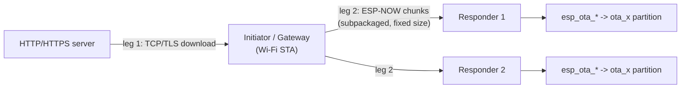
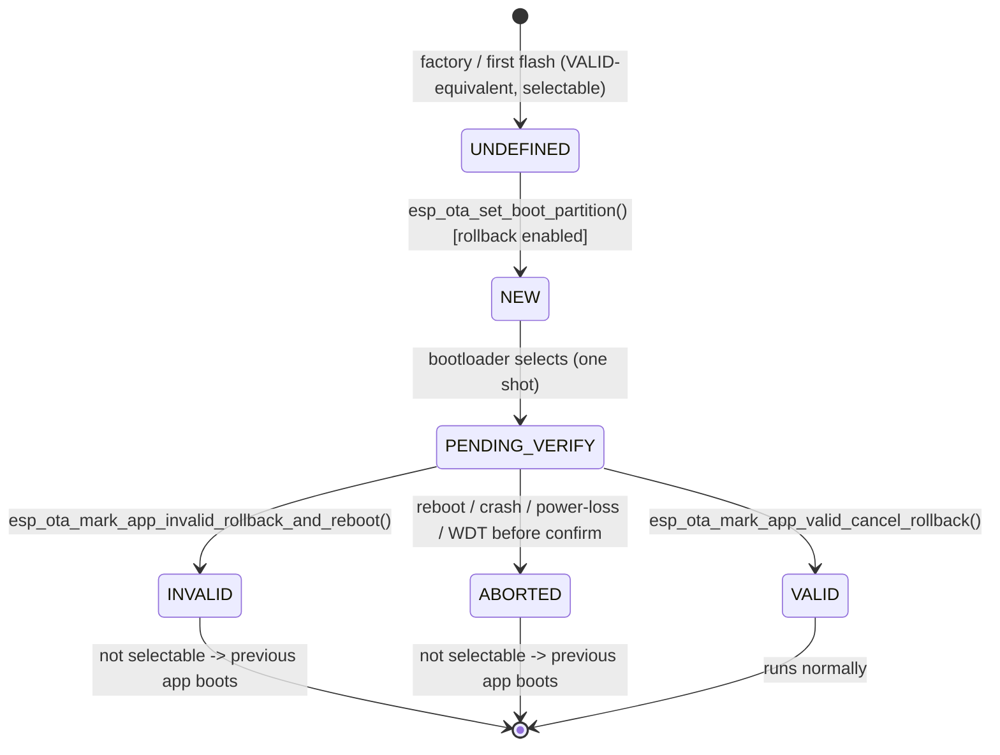

# ESP-NOW OTA — Robustness & Failure Analysis (ESP-IDF v6.0.0)

Companion to `esp_now_mesh_architecture.md`. Targets: ESP32 / S3 / C3 / C5 / C6 on ESP-IDF v6.0.0, 4 MB flash. (ESP8266 uses RTOS-SDK; its OTA API and otadata layout are older — verify separately if it participates.)

---

## 0. What "OTA via ESP-NOW" actually is (two transports, one flash API)

ESP-NOW carries **no IP stack**, so it cannot pull a binary from an HTTP server directly. The `espressif/esp-now` component's OTA works in **two legs**:

The component subpackages the firmware into fixed-size packets, each responder **records which packets it has written**, and an interrupted transfer **resumes from the breakpoint** (only missing packets are re-requested). On the responder, the flash-write path is the **standard `esp_ota_*` API** — so all the bootloader/rollback mechanics below are identical to wired/HTTP OTA. The transport only changes *where the bytes come from*, not how flash is committed.

**Consequence for failure analysis:** a "Wi-Fi drop" only affects **leg 1** (the gateway's download). A responder's transport risk is "ESP-NOW packet loss / gateway reboot mid-stream," which maps onto the same recovery primitive (`esp_ota_resume()` / re-request packets). The flash-commit risks (the `esp_ota_*` sequence) are shared by both.

---

## 1. Foundation: the otadata mechanism (why most failures are safe)

- **Partition scheme:** `factory` + `ota_0`/`ota_1`, or `ota_0`/`ota_1` only. OTA always writes to the **non-running** slot — `esp_ota_begin()` on the running partition returns `ESP_ERR_OTA_PARTITION_CONFLICT`.
- **`otadata` partition:** **two flash sectors**, each holding `{ota_seq, ota_state, crc}`. The bootloader picks the **active** copy = the one with the **higher valid `ota_seq` whose CRC matches**, then `boot_index = (ota_seq - 1) % app_count`.
- The OTA **state** (NEW / PENDING_VERIFY / VALID / INVALID / ABORTED / UNDEFINED) lives in `otadata`, **not** in the app image.

This **two-copy + sequence + CRC** layout is the core anti-brick property: a half-written `otadata` sector has a bad CRC, so the bootloader simply ignores it and uses the other (older, intact) copy. A torn write **cannot** point the bootloader at a broken app.

---

## 2. Failure-scenario matrix

| When power/Wi-Fi is lost | What is mid-flight | What the bootloader sees next boot | Net effect | Recovery |
|---|---|---|---|---|
| **During download** (streaming `esp_ota_write`) | Staging slot partially written | `otadata` **unchanged** → still points to running app | Boots **old** app; stale partial image in staging is inert | Next OTA re-erases staging, or `esp_ota_resume()` continues from offset |
| **During `esp_ota_write`** (the call itself) | A flash page in staging | Same — only staging flash touched, `otadata` untouched | Boots **old** app | Retry / resume |
| **During `esp_ota_end`** | Image validation (checksum/SHA-256, + signature if secure boot); optional copy-to-final | Boot selection **not yet changed** | Boots **old** app (handle is freed regardless of result) | Retry the whole write |
| **During `esp_ota_set_boot_partition`** ⚠️ | Writing the **inactive** `otadata` sector (new `ota_seq`, state NEW/UNDEFINED) | If torn → that sector's **CRC is wrong** → bootloader uses the **other** (old) copy | Boots **old** app — update "didn't take" | Retry the OTA |
| **Wi-Fi drop during HTTP/HTTPS** (leg 1) | TCP read returns 0 / `errno=ECONNRESET`; check `esp_http_client_is_complete_data_received()` | `otadata` unchanged (app should `esp_ota_abort()`) | Old app keeps running | Retry, or `esp_ota_resume()` from offset |
| **Corrupted image** | — | Caught at `esp_ota_end` → `ESP_ERR_OTA_VALIDATE_FAILED`; never set as boot. If it slips through, the **bootloader re-verifies** checksum/SHA-256 at boot | Stays on / rolls back to good app — **unless** validation was disabled (see §7) | Re-download |

**Bottom line:** with stock config + two app banks, **none** of the four power-loss windows bricks the device. The `esp_ota_set_boot_partition` window is the only "interesting" one, and the CRC on the inactive otadata sector makes even that fail-safe.

---

## 3. Bootloader behavior (the actual selection algorithm)

From `bootloader_support` (`bootloader_utility.c`), each reset:

1. Read `otadata[0]`, `otadata[1]`.
2. **Both invalid** (`ota_seq == 0xFFFFFFFF` or CRC mismatch) **or** `app_count == 0`:
   - `factory` exists → boot **factory**.
   - else → try **ota_0**; if both otadata are initial/bad-CRC, mark "initial contents" and set a correct `ota_seq`.
3. Otherwise → `active = ` copy with higher valid `ota_seq`; `boot_index = (ota_seq - 1) % app_count`.
   - If **rollback enabled** and active state `== ESP_OTA_IMG_NEW` → rewrite it to `PENDING_VERIFY` (this is the "one-shot" — the new app gets exactly one boot to prove itself).
   - If **anti-rollback enabled** and state `== VALID` → **burn the eFuse** secure version (irreversible).
   - If active is invalid → fall back to `factory`; if none → "try all partitions."
4. **Image validation at boot:** the bootloader verifies the selected app's checksum + SHA-256 (and signature under secure boot) **before** jumping — unless a `CONFIG_BOOTLOADER_SKIP_VALIDATE_*` option is set.
5. **RTC watchdog:** `CONFIG_BOOTLOADER_WDT_ENABLE` (default **on**, 9000 ms) tracks from bootloader start until `app_main()`. If no app reaches `app_main` in time, it resets the chip — which, with rollback on, becomes a rollback.

---

## 4. Rollback mechanism flow

The flow when `CONFIG_BOOTLOADER_APP_ROLLBACK_ENABLE` is set:

1. New image written, `esp_ota_set_boot_partition()` → state **NEW**, reboot.
2. Bootloader: any leftover **PENDING_VERIFY** → demote to **ABORTED** (that was a prior attempt that never confirmed). Selects an app not INVALID/ABORTED. If chosen app is **NEW** → set **PENDING_VERIFY**.
3. New app runs its **self-test**.
4. Pass → `esp_ota_mark_app_valid_cancel_rollback()` → **VALID** (no further restriction).
5. Fail → `esp_ota_mark_app_invalid_rollback_and_reboot()` → **INVALID** + reboot → previous app.
6. **Can't even reach the confirm call** (hang/crash/power-loss/WDT) → next boot demotes PENDING_VERIFY → ABORTED → **automatic rollback** to the previous working app.

**Critical API gotcha:** if the running app is still **PENDING_VERIFY** and you call `esp_ota_begin()` for the next update, it returns `ESP_ERR_OTA_ROLLBACK_INVALID_STATE`. **Confirm the running app first** (`esp_ota_mark_app_valid_cancel_rollback()`), as early as possible after a successful boot.

---

## 5. Required / recommended Kconfig

| Option | Default | Recommended | Why it matters for robustness |
|---|---|---|---|
| `CONFIG_BOOTLOADER_APP_ROLLBACK_ENABLE` | Off | **On** | Enables NEW/PENDING_VERIFY tracking → crash/power-loss/WDT during first boot auto-rolls back |
| `CONFIG_BOOTLOADER_WDT_ENABLE` | On | **Keep on** | Resets if the new app hangs before `app_main` → turns a startup hang into a rollback |
| `CONFIG_BOOTLOADER_WDT_TIME_MS` | 9000 | Size to boot + self-test | Too short → false rollback of a healthy image; too long → slow recovery |
| `CONFIG_ESP_TASK_WDT_INIT` (+ panic/reboot) | On | **Keep on** | Catches runtime hangs during the self-test window so rollback can fire |
| Partition table | — | **Two app slots** (`factory`+`ota_0`, or `ota_0`+`ota_1`) | OTA needs a non-running slot to write to |
| `CONFIG_PARTITION_TABLE_*` sizes | — | Each `ota_x` ≥ app size, fits 4 MB | Undersized slot → `ESP_ERR_INVALID_SIZE` at `esp_ota_begin` |
| `CONFIG_BOOTLOADER_APP_ANTI_ROLLBACK` / `..._APP_SECURE_VERSION` | Off / 0 | **Only if security demands** | Prevents downgrade — but **burns eFuses irreversibly**; requires `ota_0`+`ota_1` (no factory) |
| Secure Boot v2 / Flash Encryption | Off | Optional | Adds signature verification at `esp_ota_end` and at boot |
| `CONFIG_BOOTLOADER_SKIP_VALIDATE_ALWAYS` / `..._ON_POWER_ON` | Off | **Keep off** | Skipping the boot-time image check removes the safety net → a real brick path |
| `CONFIG_BOOTLOADER_SKIP_VALIDATE_IN_DEEP_SLEEP` | Off | OK to enable | Common for fast deep-sleep wake; only skips validation on wake, not cold boot |

A v6-era extra worth knowing: **Recovery Bootloader / bootloader rollback** support exists under "Bootloader config → Recovery Bootloader and Rollback" — it adds redundancy for the one component that is otherwise non-redundant (the bootloader). Evaluate it if a corrupted bootloader is in your threat model.

---

## 6. Common misconfigurations

- **Rollback on, but the app never calls `esp_ota_mark_app_valid_cancel_rollback()`** → every update rolls back on the *second* boot. Classic "OTA succeeds, then reverts on next reboot."
- **Calling `esp_ota_begin()` while still PENDING_VERIFY** → `ESP_ERR_OTA_ROLLBACK_INVALID_STATE`. Confirm first.
- **WDT timeout shorter than boot + self-test** → a perfectly good image gets rolled back. Measure worst-case startup (incl. flash-encryption/secure-boot overhead, which extends boot time).
- **Factory-only or single-OTA partition table** → no inactive slot; OTA can't run, or you try to update the running partition → `ESP_ERR_OTA_PARTITION_CONFLICT`.
- **Missing/misplaced `ota_data` partition** → bootloader can't track state → always boots `factory`; updates appear to "do nothing."
- **Flash-size mismatch** (building for >4 MB) → partition out of bounds → `ESP_ERR_INVALID_SIZE`.
- **Bumping anti-rollback `secure_version` casually** → eFuse burned; you can never run or roll back to a lower version. One bad-but-higher image with no acceptable fallback = soft-brick.
- **Not checking `esp_http_client_is_complete_data_received()`** (leg 1) → a truncated image gets written; `esp_ota_end` *does* catch it, but you waste a cycle — and it's a real brick path if you also skip validation.
- **Flash encryption + `esp_ota_write_with_offset()` not 16-byte aligned** → write fails. (Out-of-order ESP-NOW packets need offset writes — align them.)
- **Buffering the whole binary in RAM** → heap exhaustion. Stream it: `esp_ota_begin(part, OTA_SIZE_UNKNOWN/size, &h)` then chunked `esp_ota_write`.
- **Mixing `esp_ota_write()` and `esp_ota_write_with_offset()`** on one handle — not recommended; pick one model.

---

## 7. Bricking-risk scenarios (the honest list)

A **true brick** (requires physical serial/JTAG reflash) is **hard** to achieve with stock config, because the app image is fully redundant. The real risks are the **non-redundant** pieces — bootloader, partition table, eFuses — and the **safety-net-off** configs:

1. **`SKIP_VALIDATE_ALWAYS` + a corrupt image reaches the boot slot** → bootloader jumps to garbage with no check and (if rollback off) no fallback → boot loop. RTC_WDT resets but re-selects the same bad slot → **loops**. *Hard brick.*
2. **Corrupting the bootloader or partition table** (OTA misconfigured to write the bootloader offset, or wrong flash offsets). Not redundant by default → **hard brick** unless Recovery Bootloader is enabled.
3. **Anti-rollback eFuse burned beyond any deployable image** → nothing acceptable can boot → **soft brick** (no hardware fix; you must ship a correctly-signed image with secure_version ≥ the burned value).
4. **Secure-boot key mismatch** (image signed with the wrong key, or key block misburned) → bootloader rejects all images → **hard brick**.
5. **No factory + rollback off + both `ota` slots end up INVALID/ABORTED** → bootloader "tries all," may fail to find a bootable app → unbootable until reflash.
6. **In-place / single-bank update schemes** (not stock IDF) → a power loss mid-write destroys the only copy.

**Reassurance (the common worry):** power loss during *download → `esp_ota_write` → `esp_ota_end` → `esp_ota_set_boot_partition`* with stock config and two banks **always** falls back to the previous working app. That sequence is power-fail-safe by design.

---

## 8. How to simulate the failures safely

Use a **sacrificial board** for anything that burns eFuses (anti-rollback, secure boot) — those are permanent. Keep a known-good `factory` image and a serial/JTAG reflash path on the bench. Run dev with **two banks + rollback** so a bad test image self-recovers.

**Power loss (deterministic, no hardware needed).** Don't yank power randomly — instrument the OTA task to `esp_restart()` (or `esp_ota_abort()`) at the exact boundary you want to test:
- after writing *N* bytes via `esp_ota_write`,
- immediately **after `esp_ota_end`** but **before** `esp_ota_set_boot_partition`,
- immediately **after `esp_ota_set_boot_partition`** but **before** `esp_restart`.

This reproduces each torn-write window reliably. For a true power cut, gate VBAT through a MOSFET/relay driven by a GPIO that fires at a known byte offset.

**`esp_ota_set_boot_partition` tear.** You can't easily interrupt a single-sector write in software, but you can simulate its *result*: corrupt one `otadata` sector (write `0xFF` or a bad CRC via `esp_partition_write`, or erase it offline with `parttool.py`) and confirm the bootloader falls back to the other copy. Read both otadata sectors with `esptool.py`/`parttool.py` and watch the boot log's "Active otadata[x]" line.

**Wi-Fi drop (leg 1).** `esp_wifi_disconnect()` mid-transfer, kill the AP, firewall-drop the TCP flow, or detach the antenna. Verify the app detects an incomplete transfer (`esp_http_client_is_complete_data_received()` returns false) and aborts, then verify retry/`esp_ota_resume`.

**ESP-NOW packet loss (leg 2).** Drop the gateway mid-stream, or selectively discard chunks in your forwarding code, and verify the responder's resume-from-breakpoint re-requests only the missing packets.

**Corrupted image.** Flip a few bytes in the `.bin` (or truncate it) before upload → confirm `esp_ota_end` returns `ESP_ERR_OTA_VALIDATE_FAILED` and the device stays on the old app. Separately test a **valid-but-broken** app (links and boots, but fails self-test) to exercise the *rollback* path rather than the *validation* path.

**Rollback path.** Ship an app whose self-test deliberately fails (calls `esp_ota_mark_app_invalid_rollback_and_reboot()`) → confirm it boots the previous version. For the **WDT-triggered** rollback, add a busy-loop before `mark_valid` that exceeds `CONFIG_BOOTLOADER_WDT_TIME_MS` and confirm PENDING_VERIFY → ABORTED → previous app.

**Verify state at every step** with `esp_ota_get_state_partition()` and `esp_ota_get_running_partition()` in logs, plus the bootloader's own boot-selection log lines.

---

## References (ESP-IDF — v6.0.0 shares these APIs)

- OTA API: `docs.espressif.com/.../api-reference/system/ota.html` (`esp_ota_begin/write/end/abort/resume/set_boot_partition`, App Rollback, App OTA State, Rollback Process)
- Native OTA example: `examples/system/ota/native_ota_example`
- Bootloader behavior & watchdog: `docs.espressif.com/.../api-guides/bootloader.html`
- Boot-selection source: `components/bootloader_support/src/bootloader_utility.c`
- Kconfig: Bootloader config → Application Rollback (`CONFIG_BOOTLOADER_APP_ROLLBACK_ENABLE`, `..._APP_ANTI_ROLLBACK`, `..._APP_SECURE_VERSION`), `CONFIG_BOOTLOADER_WDT_ENABLE` / `..._WDT_TIME_MS`, `CONFIG_BOOTLOADER_SKIP_VALIDATE_*`
- ESP-NOW OTA component: `github.com/espressif/esp-now` (subpackaging, resume-from-breakpoint, multi-device, rollback)
